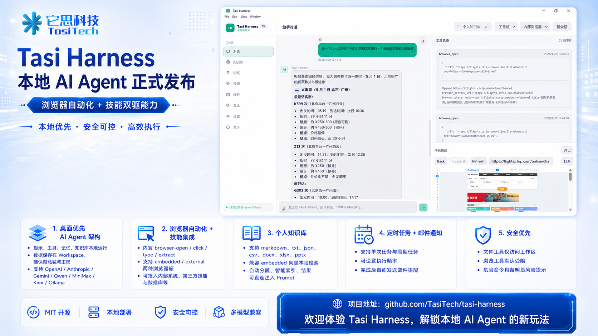

# Tasi Harness

[English](README.md) | [简体中文](README.zh-CN.md)

Tasi Harness is a local-first desktop AI agent built with Electron, TypeScript, React, and Vite. It combines a desktop-oriented chat experience with an OpenAI-compatible tool-calling runtime, browser automation, persistent memory, skills, scheduled tasks, and a personal knowledge base that converts Office documents into Markdown for retrieval.

> Tasi Harness is inspired by Hermes-Agent-style runtime patterns. It does not bundle the original Python Hermes Agent runtime.



## Highlights

- Desktop-first AI agent with local sessions, local memory, and local skill files.
- Built-in provider presets for OpenAI, Anthropic, DeepSeek, Qwen / Bailian, MiniMax, Kimi, OpenAI-compatible APIs, and Ollama.
- Built-in browser automation tools with embedded web preview and external-browser bridge mode.
- Personal knowledge base that converts `DOCX`, `XLSX`, `PPTX`, `Markdown`, `TXT`, `JSON`, and `CSV` into Markdown.
- Skill system based on editable `SKILL.md` files, plus bundled skills and marketplace sources.
- Scheduled tasks, optional email notifications, and per-run workspace sandbox copies.
- Conservative defaults: context isolation enabled, workspace-scoped file access, terminal disabled by default.

## Features

| Area | What it does |
| --- | --- |
| Agent runtime | Runs a tool-aware chat loop with prompt building, iterative tool execution, and session persistence. |
| Memory | Stores durable facts in local JSON-backed memory entries and injects relevant memory into prompts. |
| Browser automation | Supports navigation, CDP-backed external Chromium automation with optional headless launches, snapshots with `@e` refs, semantic lookup, keyboard/mouse/form actions, extraction, screenshots/PDF, storage/cookies, console, network, viewport, and close/reset tools. |
| Personal knowledge base | Converts local documents to Markdown, stores extracted assets, chunks content locally, and retrieves snippets with lexical search plus optional keyword expansion, without embeddings or an external vector DB. |
| Skills | Reads, creates, patches, uploads, and installs `SKILL.md` workflows from local files and marketplace catalogs. |
| Sessions | Keeps searchable local conversation history in JSON. |
| Scheduled tasks | Runs prompts on a schedule, can reuse sessions, and can send email notifications. |
| Workspace safety | Restricts file tools to the configured workspace and supports a copy-based sandbox execution mode. |

## Installation

Setup, packaging, and test steps are documented here:

- [Installation, Packaging, and Testing](docs/INSTALLATION_PACKAGING_TESTING.en.md)

Quick commands:

- Install dependencies: `npm install`
- Run dev app: `npm run dev`
- Build: `npm run build`
- Test: `npm test`
- Package (Windows): `npm run dist:win`
- Package (macOS): `npm run dist:mac`

## Quick Start

1. Run `npm run dev`.
2. Open **Settings** and configure your model provider.
3. Choose a workspace directory if you do not want to use the default one.
4. Go to **Chat** and start a conversation.
5. If you want document-grounded answers, open **Knowledge**, add files, then enable the **Personal KB** toggle in chat.
6. If you want reusable workflows, open **Skills** and browse bundled or marketplace skills.
7. If you want background execution, create a job in **Tasks**.

## Usage Guide

### Model providers

Tasi Harness ships with multiple provider presets in the UI:

- `OpenAI`, `DeepSeek`, `Qwen / Bailian`, `MiniMax`, `Kimi`, and `OpenAI-compatible`: use a `/chat/completions` style endpoint with tool-calling support.
- `Anthropic`: uses the `/messages` API with tool-use blocks.
- `Ollama`: uses local `/api/chat` requests for local models.

### Browser automation and preview

Tasi Harness includes built-in browser and extenal browser tools modes.

Detailed guide:

- [Browser Automation](docs/BROWSER_AUTOMATION.en.md)

### Personal knowledge base

The **Knowledge** flow supports document upload and local retrieval-augmented context injection for chat, without requiring embeddings or an external vector DB.

Detailed guide:

- [Personal Knowledge Base](docs/PERSONAL_KNOWLEDGE_BASE.en.md)

### Skills and skill marketplace

Skills are plain `SKILL.md` files with frontmatter and instructions. You can:

- browse bundled skills
- create or patch local skills
- upload skill archives
- browse marketplace catalogs such as ClawHub and SkillHub

Bundled browser automation guidance is available as the `tasi-browser-automation` skill.

### Sessions and memory

Tasi Harness stores:

- session history as local JSON files
- durable environment, project, and user memory entries in `~/.tasi-harness/memories/entries.v2.json`
- legacy `MEMORY.md` and `USER.md` files are imported on first run when present

Memory updates are queued during a run and committed after the run completes, which reduces partial-memory writes from failed executions.

### Scheduled tasks and notifications

The **Tasks** page supports:

- one-time runs
- interval-based runs
- per-task execution mode selection
- optional email notifications after completion

Scheduled tasks can continue an existing session or create a new one as needed.

### Execution modes

Two execution modes are available:

- `workspace`: tools operate directly inside the configured workspace directory.
- `sandbox`: the workspace is copied into a per-run sandbox directory before the run starts.

## Data Locations

By default, app data is stored under:

```text
~/.tasi-harness/
```

Important paths:

```text
~/.tasi-harness/config.json
~/.tasi-harness/workspace/
~/.tasi-harness/memories/entries.v2.json
~/.tasi-harness/sessions/
~/.tasi-harness/skills/
~/.tasi-harness/personal-knowledge/
~/.tasi-harness/sandboxes/
```

## Security Notes

Tasi Harness is designed with conservative local defaults, but it is still a powerful desktop agent. Current protections include:

- Electron context isolation with a typed preload bridge
- no direct Node.js access from the renderer
- workspace-confined file tools
- terminal tool disabled by default
- blocking of several obviously dangerous shell command patterns even when terminal access is enabled

This is not a complete sandbox for untrusted workloads. For higher-risk automation, keep terminal access disabled or run the app inside an OS/container sandbox.

More details: [docs/SECURITY.en.md](docs/SECURITY.en.md)

## Project Structure

```text
src/
  main/       Electron main process, agent loop, tools, storage, scheduler
  preload/    Typed context bridge
  renderer/   React UI
  shared/     Shared TypeScript types
resources/
  skills/     Bundled SKILL.md assets
  markets/    Marketplace catalogs
tests/        Vitest test suite
docs/         Engineering and security documentation
```

## Documentation

- [Architecture](docs/ARCHITECTURE.en.md)
- [Development Guide](docs/DEVELOPMENT.en.md)
- [Security](docs/SECURITY.en.md)
- [Verification Notes](docs/VERIFICATION.en.md)
- [Installation, Packaging, and Testing](docs/INSTALLATION_PACKAGING_TESTING.en.md)
- [Browser Automation](docs/BROWSER_AUTOMATION.en.md)
- [Personal Knowledge Base](docs/PERSONAL_KNOWLEDGE_BASE.en.md)
- [Release Notes (v1.2.0)](docs/release_v1.2.0.en.md)
- [Release Notes Archive (v1.1.0)](docs/release_v1.1.0.en.md)

## References and Acknowledgements

- Hermes Agent: architectural inspiration for prompt building, tool loops, and procedural memory patterns
- Electron: desktop shell and process model
- React + Vite: renderer stack
- Vitest: test runner
- JSZip: Office document and archive processing

## License

[MIT](LICENSE)
