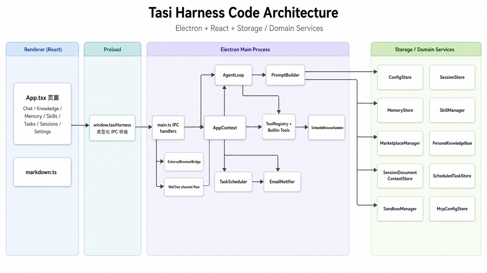

# Architecture

[English](ARCHITECTURE.en.md) | [简体中文](ARCHITECTURE.zh-CN.md)

This document reflects the current code architecture of Tasi Harness.

## High-Level Runtime

Tasi Harness is an Electron desktop app with three layers:

- Renderer (`src/renderer/*`): React UI pages and interaction state.
- Preload (`src/preload/*`): typed `window.tasiHarness` bridge.
- Main process (`src/main/*`): agent runtime, tools, stores, browser bridge, scheduler, notifications, and IPC handlers.

## Code Architecture Diagram


## Main Composition (`AppContext`)

`src/main/appContext.ts` wires core services:

- Stores: `ConfigStore`, `MemoryStore`, `SessionStore`, `ScheduledTaskStore`, `McpConfigStore`
- Skills: `SkillManager`, `MarketplaceManager`
- Knowledge: `PersonalKnowledgeBase`, `SessionDocumentContextStore`
- Runtime: `ToolRegistry`, `PromptBuilder`, `AgentLoop`, `SandboxManager`
- Channels/Tasks: `EmailNotifier`, `TaskScheduler`, `EmbeddedBrowserAutomation`

It also seeds bundled skills and starts scheduler polling.

## IPC and Application Control (`main.ts`)

`src/main/main.ts` hosts:

- IPC APIs for config, agent chat/stop, sessions, memory, knowledge, session-doc upload, skills, marketplace, tasks, tools, and app utilities.
- External browser preview lifecycle (`ExternalBrowserBridge`) and embedded preview binding.
- WeChat channel integration (QR login state, message polling, external message append, and agent-triggered reply path).
- Automatic external preview cleanup after run completion/stop.

## Agent Execution Flow

```mermaid
sequenceDiagram
  participant UI as Renderer
  participant IPC as main.ts
  participant LOOP as AgentLoop
  participant PROMPT as PromptBuilder
  participant LLM as LlmClient
  participant TOOLS as ToolRegistry
  participant STORE as SessionStore/MemoryStore

  UI->>IPC: agent:chat(input, sessionId, mode, usePKB)
  IPC->>LOOP: run(...)
  LOOP->>STORE: beginDeferredMemory + append user message
  LOOP->>PROMPT: build(system prompt)
  LOOP->>LLM: complete(messages, tools)
  LLM-->>LOOP: assistant + tool_calls/answer
  LOOP->>TOOLS: execute tool calls (iterative)
  TOOLS-->>LOOP: tool results
  LOOP->>STORE: append messages/tool events
  LOOP->>STORE: commitDeferredMemory + sync session memory
  LOOP-->>IPC: final response + usage + events
  IPC-->>UI: result + session update events
```

## Prompt Construction

`PromptBuilder` composes:

- system persona and operating model
- current timestamp and inferred domains
- memory snapshot
- optional personal knowledge snapshot (`PersonalKnowledgeBase`)
- optional session document XML snapshot (`SessionDocumentContextStore`)
- installed skills index
- browser mode/external bridge guidance

## Knowledge Architecture

Two independent knowledge paths are implemented:

1. Personal Knowledge Base (`src/main/knowledge/personalKnowledgeBase.ts`)
- Upload docs, convert to Markdown, chunk, lexical retrieval (+ optional keyword expansion).
- Used when chat enables personal KB.

2. Session Document Context (`src/main/knowledge/sessionDocumentContextStore.ts`)
- Upload per-session files (docx/xlsx/pptx/pdf/txt/etc), convert to XML prompt context.
- Optional workspace copy is saved for editing workflows.
- Injected into prompt as bounded XML snippets.

## Task Scheduling and Notifications

`TaskScheduler` polls due tasks every 15 seconds:

- runs prompt tasks via `AgentLoop`
- records result + trace in `ScheduledTaskStore`
- accumulates token usage in `SessionStore`
- sends optional SMTP email notifications (`EmailNotifier`)
- sends optional WeChat notifications (channel token/context based)

## Persistence Layout

Default root: `~/.tasi-harness/`

Key paths:

- `config.json`
- `sessions/`
- `memories/entries.v2.json`
- `skills/`
- `personal-knowledge/`
- `session-documents/`
- `scheduled-tasks.json`
- `sandboxes/`
